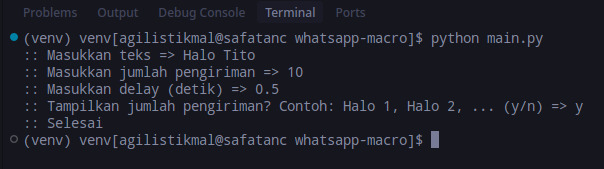
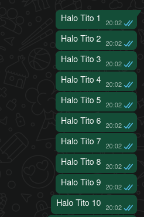

## WhatsApp Macro
#### Send spam message

### ⚠ Warning: Use at your own risk!

## How to usage

### (Optional) Create Environment
```zsh
python -m venv venv
```

Linux/MacOS:
```zsh
source ./venv/bin/activate
```

Windows:
```zsh
./venv/Script/Activate
```

### Install Dependencies
```zsh
pip install -r requirements.txt
```

### Run
```zsh
python main.py
```

### Start your message


